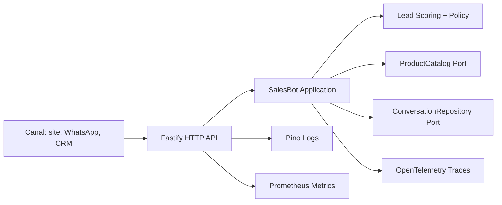

# Sales Bot

Bot de vendas em TypeScript com arquitetura testavel, logs estruturados e observabilidade pronta para Prometheus/OpenTelemetry.

Inclui uma interface PWA responsiva: chat e cardapio lado a lado no desktop, com abas de Chat, Lead e Cardapio no mobile.

## Decisao de arquitetura

- **Dominio isolado:** regras de qualificacao, score e resposta ficam em `src/domain` e `src/application`.
- **Ports and adapters:** catalogo, persistencia, HTTP, logs e metricas entram como portas/adaptadores.
- **Observabilidade desde o inicio:** logs JSON com `requestId`, metricas Prometheus em `/metrics` e tracing OTLP opcional.
- **Testabilidade:** o bot roda em memoria nos testes; API e dominio sao testados sem subir servidor real.
- **Evolucao facil:** trocar memoria por Postgres/Redis, catalogo por CRM ou resposta deterministica por LLM nao muda o contrato central.



## Como rodar

```bash
npm install
npm run dev
```

API local:

- `GET /` - interface PWA
- `GET /health`
- `GET /ready`
- `GET /metrics`
- `GET /products`
- `POST /messages`
- `GET /conversations/:sessionId`

Exemplo:

```bash
curl -X POST http://localhost:3000/messages \
  -H "content-type: application/json" \
  -d '{
    "sessionId": "lead-1",
    "channel": "web",
    "text": "Sou Ana, preciso de automacao de vendas e CRM agora. Meu email e ana@example.com, tenho orcamento R$ 5000 e autorizo contato."
  }'
```

## Testes

```bash
npm test
npm run build
npm run check
```

## Logs

Por padrao os logs sao estruturados em JSON. Para desenvolvimento:

```bash
LOG_PRETTY=true npm run dev
```

Campos importantes:

- `requestId`
- `sessionId`
- `stage`
- `score`
- `handoff`
- `recommendedProductIds`

## Observabilidade

Metricas Prometheus ficam em `/metrics`, incluindo:

- `http_request_duration_seconds`
- `bot_messages_total`
- metricas padrao do Node.js via `prom-client`

Tracing OTLP e opcional:

```bash
OTEL_EXPORTER_OTLP_ENDPOINT=http://localhost:4318/v1/traces npm run dev
```

## PWA e GitHub Pages

O servidor Node entrega manifesto, icone e service worker junto da interface. Para gerar o pacote estatico do GitHub Pages:

```bash
npm run build:pages
```

O resultado fica em `_site`. O workflow `.github/workflows/pages.yml` publica esse diretorio automaticamente quando a `main` recebe um push.

No GitHub Pages, a interface usa um modo demonstracao local porque Pages nao executa o backend Node. Em uma hospedagem Node, ela usa a API real com persistencia, logs, metricas e tracing.

## Proximos adaptadores naturais

- `ConversationRepository`: Postgres, Redis ou DynamoDB.
- `ProductCatalog`: CRM, ERP ou planilha de catalogo.
- `CrmGateway`: HubSpot, Pipedrive ou Salesforce.
- `SalesCopyGenerator`: LLM para resposta natural, mantendo testes deterministas no dominio.
