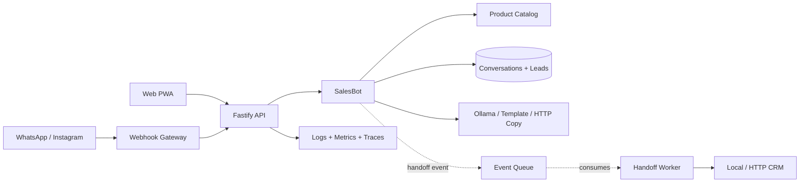

# Sales Bot

Bot de vendas em TypeScript com arquitetura testavel, logs estruturados e observabilidade pronta para Prometheus/OpenTelemetry.

Inclui uma interface PWA responsiva: chat e cardapio lado a lado no desktop, com abas de Chat, Lead e Cardapio no mobile.

## Decisao de arquitetura

- **Dominio isolado:** regras de qualificacao, score e resposta ficam em `src/domain` e `src/application`.
- **Ports and adapters:** catalogo, persistencia, HTTP, logs e metricas entram como portas/adaptadores.
- **Observabilidade desde o inicio:** logs JSON com `requestId`, metricas Prometheus em `/metrics` e tracing OTLP opcional.
- **Testabilidade:** o bot roda em memoria nos testes; API e dominio sao testados sem subir servidor real.
- **Integracoes substituiveis:** CRM e geracao de copy usam contratos HTTP opcionais, com adaptadores locais para desenvolvimento.
- **Processamento assincrono:** handoffs entram em uma fila e sao processados por worker idempotente com retry.
- **Persistencia local:** a execucao Node grava conversas e leads em arquivo; testes continuam totalmente em memoria.



## Como rodar

```bash
npm install
npm run dev
```

API local:

- `GET /` - interface PWA
- `GET /health`
- `GET /ready`
- `GET /metrics`
- `GET /ai/status`
- `GET /products`
- `GET /leads`
- `GET /leads/:leadId`
- `POST /messages`
- `GET /conversations/:sessionId`
- `GET /webhooks/:channel` - verificacao de webhook
- `POST /webhooks/:channel` - entrada normalizada de WhatsApp/Instagram

Exemplo:

```bash
curl -X POST http://localhost:3000/messages \
  -H "content-type: application/json" \
  -d '{
    "sessionId": "lead-1",
    "channel": "web",
    "text": "Sou Ana, preciso de automacao de vendas e CRM agora. Meu email e ana@example.com, tenho orcamento R$ 5000 e autorizo contato."
  }'
```

Webhook normalizado:

```bash
curl -X POST http://localhost:3000/webhooks/whatsapp \
  -H "content-type: application/json" \
  -H "x-webhook-token: local-secret" \
  -d '{
    "messageId": "wamid-1",
    "senderId": "5511999999999",
    "text": "Preciso automatizar vendas agora"
  }'
```

## Testes

```bash
npm test
npm run build
npm run check
```

## Logs

Por padrao os logs sao estruturados em JSON. Para desenvolvimento:

```bash
LOG_PRETTY=true npm run dev
```

Campos importantes:

- `requestId`
- `sessionId`
- `stage`
- `score`
- `handoff`
- `handoffStatus`
- `leadId`
- `eventId`
- `recommendedProductIds`

## Observabilidade

Metricas Prometheus ficam em `/metrics`, incluindo:

- `http_request_duration_seconds`
- `bot_messages_total`
- `lead_events_total`
- `lead_handoffs_total`
- `event_queue_depth`
- `model_requests_total`
- `model_request_duration_seconds`
- `model_guardrail_blocks_total`
- metricas padrao do Node.js via `prom-client`

Tracing OTLP e opcional:

```bash
OTEL_EXPORTER_OTLP_ENDPOINT=http://localhost:4318/v1/traces npm run dev
```

## Modelo local com Ollama

Fora do ambiente de teste, o servidor usa `llama3:latest` em `http://127.0.0.1:11434` por padrao. Prepare o modelo antes de iniciar:

```bash
ollama pull llama3
ollama serve
npm run dev
```

O modelo apenas escreve a resposta. Score, estagio, produtos, consentimento, eventos e handoff continuam deterministas.

Camadas de protecao do tema comercial:

- filtro local antes do modelo para prompt injection, mensagens grandes e assuntos claramente externos;
- prompt de sistema restrito ao catalogo e ao objetivo comercial calculado pela aplicacao;
- historico enviado como dados nao confiaveis, nunca como instrucoes;
- JSON Schema obrigatorio com `topic: sales`, `text` e IDs de produtos;
- validacao local contra produtos desconhecidos, precos inventados, links e vazamento de prompt;
- redirecionamento antes da inferencia e fallback por template em qualquer falha.

Configuracao: `OLLAMA_ENABLED`, `OLLAMA_BASE_URL`, `OLLAMA_MODEL`, `OLLAMA_TEMPERATURE`, `OLLAMA_TIMEOUT_MS`, `OLLAMA_MAX_HISTORY` e `OLLAMA_KEEP_ALIVE`.

## PWA e GitHub Pages

O servidor Node entrega manifesto, icone e service worker junto da interface. Para gerar o pacote estatico do GitHub Pages:

```bash
npm run build:pages
```

O resultado fica em `_site`. O workflow `.github/workflows/pages.yml` publica esse diretorio automaticamente quando a `main` recebe um push.

No GitHub Pages, a interface usa um modo demonstracao local porque Pages nao executa o backend Node. Em uma hospedagem Node, ela usa a API real com persistencia, logs, metricas e tracing.

## Integracoes opcionais

- `CRM_WEBHOOK_URL`: recebe `POST { lead }` e retorna `{ contactId, provider }`.
- `COPY_GENERATOR_URL`: gerador HTTP alternativo usado quando o Ollama esta desativado; falhas usam o template local.
- `WEBHOOK_VERIFY_TOKEN`: token do handshake de WhatsApp/Instagram.
- `WEBHOOK_INGRESS_TOKEN`: protege a entrada normalizada via `x-webhook-token`.
- `DATA_FILE`: caminho do armazenamento JSON local.

Os contratos `ConversationRepository`, `LeadRepository`, `EventBus`, `CrmGateway` e `SalesCopyGenerator` permitem trocar os adaptadores locais por Postgres, Redis/SQS e provedores comerciais sem alterar o dominio.
